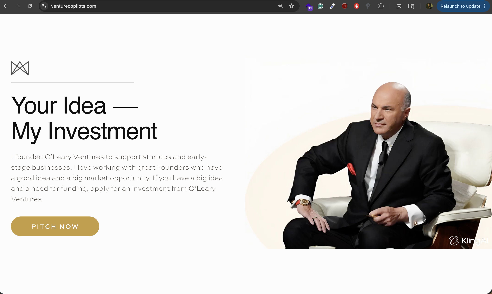
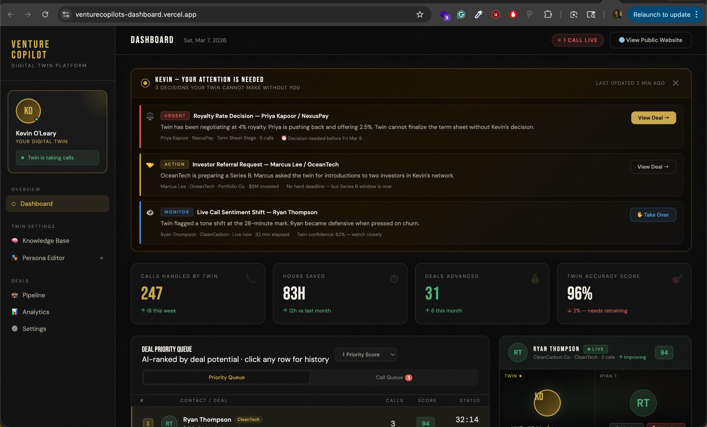

# VentureCopilots.com

**The AI gatekeeper for venture capital.** Every VC is drowning in cold pitches — thousands of emails a week. We give VCs an AI twin that lives on their website, grills every founder, scores their pitch, and hands the VC a ranked dashboard of the best deals. A 24/7 partner that never sleeps.



---

## ✨ What It Does

Founders visit a VC's website and are greeted by their **AI screening agent** — a lifelike video avatar that conducts live pitch interviews. The agent asks tough questions about market size, traction, defensibility, and the ask. Strong pitches get escalated. Weak ones get honest feedback. The VC only sees the best.

---

## 🎥 The Experience

### For Founders

**Landing Page → Video Call → Pitch → Get Ranked**

1. Land on the VC's website
2. Click **Start Call** — instantly face-to-face with the VC's AI agent
3. The agent opens with: *"I'm Kevin's Agent. What's the problem you're solving — you've got 60 seconds. Go!"*
4. Pitch naturally — speak or type
5. Get grilled with sharp follow-up questions about market, traction, and moat
6. If the pitch is strong: *"Drop your deck, LinkedIn, and email — Kevin personally reviews every Thursday."*
7. Upload your pitch deck for deeper AI analysis
8. Call ends with an automated summary of the conversation

### For VCs

**Embed → Filter → Review the best**

- An AI agent that screens every inbound founder automatically
- Each conversation is scored, summarized, and saved
- Pitch decks are analyzed with investor-grade AI feedback
- A ranked dashboard of the best deals — no more cold email triage
- Replace $150K/year analyst work for $500/month

---

## 🚀 Features

### 🟢 One-Click Video Calls
Founders click **Start Call** and they're instantly connected to a high-definition AI avatar. No scheduling, no forms — just pitch.


### 🎙️ Voice + Text
Speak naturally through the microphone or type in the chat panel. The avatar responds to both with lip-synced video.

### 🧠 Kevin-Style AI Screening
The AI agent channels a tough, financially disciplined VC voice:
- *"How big is this market and who's writing checks for it right now?"*
- *"Why can't someone build this tomorrow and cut you out entirely?"*
- *"Bold claim. Show me the numbers."*

Every response is context-aware — the AI remembers the full conversation and pushes deeper.

### 📊 Pitch Deck Analysis
Founders upload their deck (PDF) and get instant investor-grade feedback:
- What the company does
- Strongest investment signal
- Biggest concern
- 3 sharp follow-up questions

### ✋ Interrupt Anytime
Just like a real conversation — interrupt the avatar mid-sentence and redirect.

### 📝 Call Summaries


When the call ends, the AI generates a concise summary:
- Key topics discussed
- Message count and call duration
- Animated popup with smooth transitions
- Everything saved to the database automatically

### 💾 Automatic Transcript Storage
Every conversation — full transcript, AI summary, pitch deck analysis — is saved to a secure database. VCs can review past screenings anytime.



---

## 🖥️ Interface

| Area | What It Does |
|------|-------------|
| 🎬 Video Stage | Lifelike AI avatar with real-time lip-synced responses |
| 💬 Chat Panel | Message bubbles showing the full conversation flow |
| 🟢 Start Call | One click to begin the pitch screening |
| 🔴 End Call | Ends session, generates summary, saves transcript |
| ✋ Interrupt | Stop the avatar mid-sentence |
| ⌨️ Text Input | Type messages when you prefer text over voice |
| 📎 Deck Upload | Upload a PDF pitch deck for AI analysis |

---

## 💡 Sample Conversation

> **Kevin AI:** I'm Kevin's Agent. What's the problem you're solving — you've got 60 seconds. Go!
>
> **Founder:** We're Venture Copilot — an AI agent that lives on a VC's website, interviews every founder, and escalates the best ones to the VC to follow up.
>
> **Kevin AI:** How big is this market and who's paying for it today?
>
> **Founder:** 10,000 active VCs globally. They're paying analysts $150K a year to filter inbound. We replace that for $500 a month. $2B TAM and nobody owns it yet.
>
> **Kevin AI:** Bold claim. Why can't VCs just build this themselves tomorrow and cut you out entirely?
>
> **Founder:** They can build a chatbot. They can't build our moat — proprietary ranking models trained on real deal flow data. The data compounds with every conversation.
>
> **Kevin AI:** Okay, you got my attention. Drop your deck, LinkedIn, and email — Kevin personally reviews every Thursday.

---

## 🔒 Privacy & Security

- API credentials never reach the browser — all authentication is server-side
- Conversations stored in a secure Supabase database
- No third-party tracking or analytics

---

## 🛠️ Setup

### Prerequisites
- Python 3.9+
- Node.js 18+
- [Akool](https://akool.com) account (avatar video)
- [Google Cloud](https://cloud.google.com) account (Gemini AI)
- [Supabase](https://supabase.com) database (transcript storage)

### Quick Start

```bash
# Clone
git clone https://github.com/starwheel/talk-to-my-agent
cd talk-to-my-agent

# Backend
cd backend
cp .env.example .env    # Edit with your API keys
python3 -m venv .venv && source .venv/bin/activate
pip install -r requirements.txt
python run.py

# Frontend (new terminal)
cd test-avatar/frontend
npm install
npm run dev
```

Open **http://localhost:5174** and start pitching.

### Environment Variables

```env
# Avatar Service (Akool)
AKOOL_API_TOKEN=your_token
AKOOL_AVATAR_ID=your_avatar_id
AKOOL_VOICE_ID=your_voice_id

# AI (Google Gemini)
GEMINI_API_KEY=your_gemini_key
GEMINI_MODEL=gemini-2.5-flash-lite

# Database (Supabase)
DB_URL=your_supabase_host
DB_USER=your_db_user
DB_PASSWORD=your_db_password
DB_NAME=postgres
DB_PORT=5432
```

---

## 📄 License

MIT
