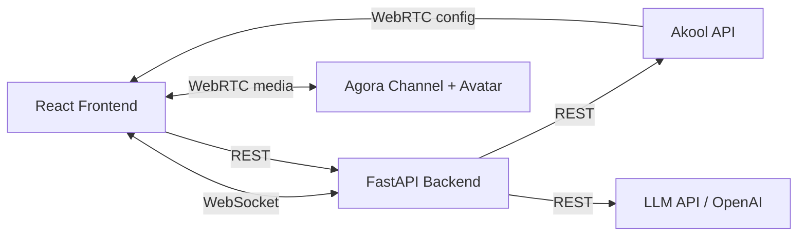

# Avatar Video Call Backend (FastAPI)

FastAPI backend that orchestrates the video-call avatar workflow.  
Keeps all credentials server-side and manages conversation state.

---

## Architecture



### What the backend does
- **Proxies Akool APIs** — session create/close, avatar/voice lists (credentials never touch frontend)
- **Calls your LLM** — receives user transcript, returns reply text
- **Manages conversation memory** — per-user history (in-memory, swap for Redis/DB in prod)
- **WebSocket turn events** — real-time `thinking/reply/speaking/interrupt` state sync

### What the frontend still does
- Joins Agora channel, publishes user mic/cam
- Renders avatar video/audio stream
- Calls `sendMessage(responseText)` to trigger avatar speech over data channel

---

## Project Structure

```
backend/
├── run.py                  # Entry point (uvicorn)
├── requirements.txt
├── .env.example
└── app/
    ├── __init__.py
    ├── config.py           # Settings from env vars
    ├── models.py           # Pydantic request/response models
    ├── main.py             # FastAPI app, routes, WebSocket
    ├── akool_service.py    # Akool API proxy
    ├── llm_service.py      # LLM/AI reply service
    └── conversation.py     # In-memory conversation state
```

---

## Quick Start

### 1) Install

```bash
cd backend
python -m venv .venv
source .venv/bin/activate   # Windows: .venv\Scripts\activate
pip install -r requirements.txt
```

### 2) Configure

```bash
cp .env.example .env
```

Edit `.env`:
```env
AKOOL_CLIENT_ID=your_client_id
AKOOL_CLIENT_SECRET=your_client_secret
GEMINI_API_KEY=your_gemini_api_key
```

### 3) Run

```bash
python run.py
```

Server starts at `http://localhost:8000`.  
API docs at `http://localhost:8000/docs`.

---

## API Reference

### REST Endpoints

| Method | Path | Description |
|--------|------|-------------|
| `GET` | `/health` | Health check |
| `POST` | `/api/session/create` | Create Akool avatar session |
| `POST` | `/api/session/{id}/close` | Close avatar session |
| `GET` | `/api/avatars` | List available avatars |
| `GET` | `/api/voices` | List available voices |
| `POST` | `/api/conversation/reply` | Send transcript, get LLM reply |
| `DELETE` | `/api/conversation/{user_id}` | Clear conversation history |

### Conversation Reply

**Request:**
```json
POST /api/conversation/reply
{
  "user_id": "user_123",
  "transcript": "What's the pricing?",
  "history": []
}
```

**Response:**
```json
{
  "response_text": "Here's a quick breakdown...",
  "turn_id": "a1b2c3d4"
}
```

### WebSocket

Connect to `ws://localhost:8000/ws/{user_id}`

**Frontend sends:**
```json
{"type": "transcript", "data": {"text": "user speech text"}}
{"type": "interrupt", "data": {}}
```

**Backend sends:**
```json
{"type": "status", "data": {"state": "thinking"}}
{"type": "reply", "data": {"text": "response...", "turn_id": "abc123"}}
{"type": "status", "data": {"state": "speaking"}}
{"type": "error", "data": {"message": "error details"}}
```

---

## Frontend Integration

### Option A: REST (simple)

```ts
const res = await fetch("http://localhost:8000/api/conversation/reply", {
  method: "POST",
  headers: { "Content-Type": "application/json" },
  body: JSON.stringify({ user_id: "user1", transcript }),
});
const { response_text } = await res.json();
await streamingContext.sendMessage(response_text);
```

### Option B: WebSocket (real-time, recommended)

```ts
const ws = new WebSocket("ws://localhost:8000/ws/user1");

// Send user transcript
ws.send(JSON.stringify({ type: "transcript", data: { text: transcript } }));

// Handle backend events
ws.onmessage = async (event) => {
  const msg = JSON.parse(event.data);
  if (msg.type === "reply") {
    await streamingContext.sendMessage(msg.data.text);
  }
  if (msg.type === "status") {
    updateTurnState(msg.data.state); // "thinking" | "speaking" | "listening"
  }
};

// Interrupt (user starts talking while avatar speaks)
ws.send(JSON.stringify({ type: "interrupt", data: {} }));
```

---

## Production Notes

- Replace in-memory conversation store with **Redis** or a database
- Add **authentication middleware** (JWT, API keys)
- Add **rate limiting** per user
- Deploy behind **nginx/caddy** reverse proxy
- Use **streaming LLM responses** (SSE/chunked) for lower latency
- Add **logging/tracing** (OpenTelemetry)
